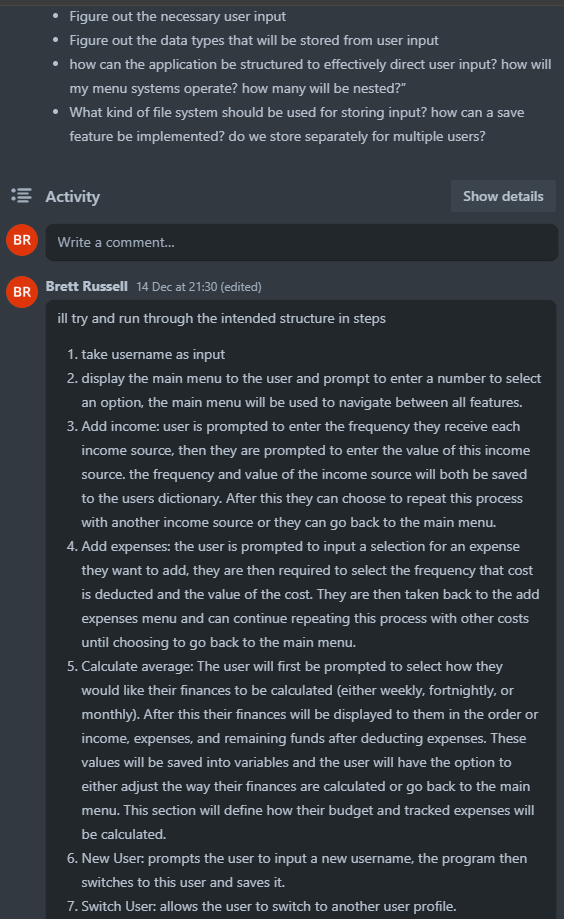
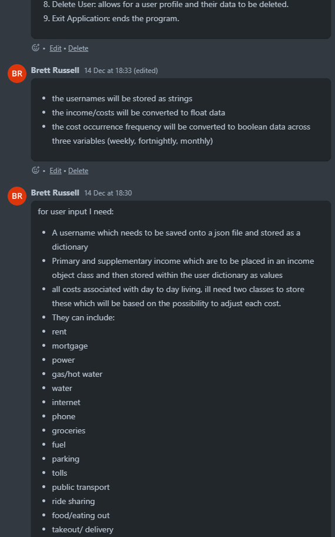
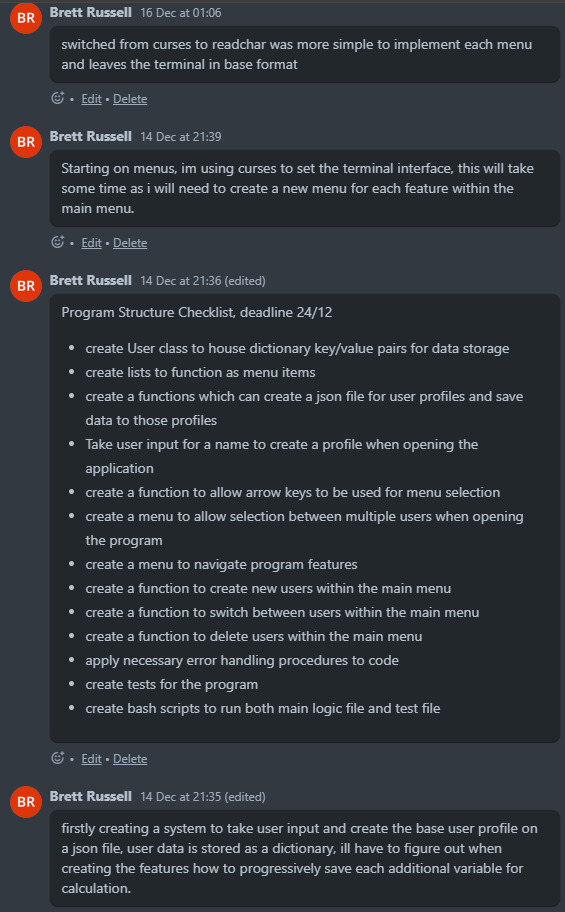
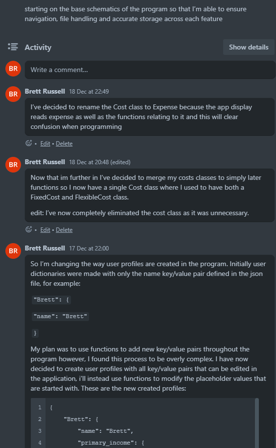
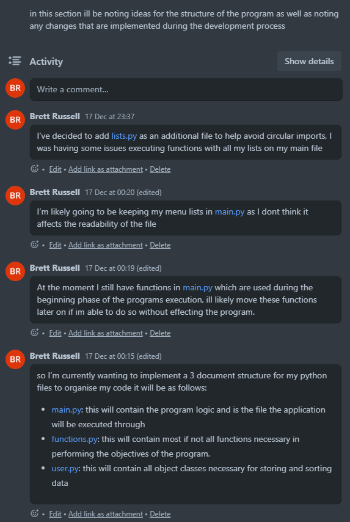
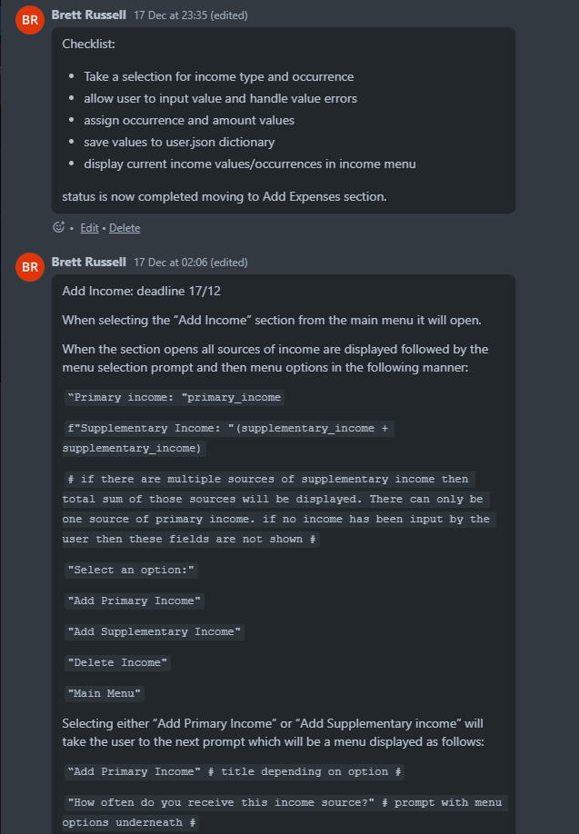
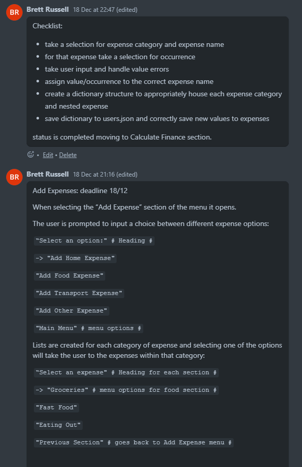
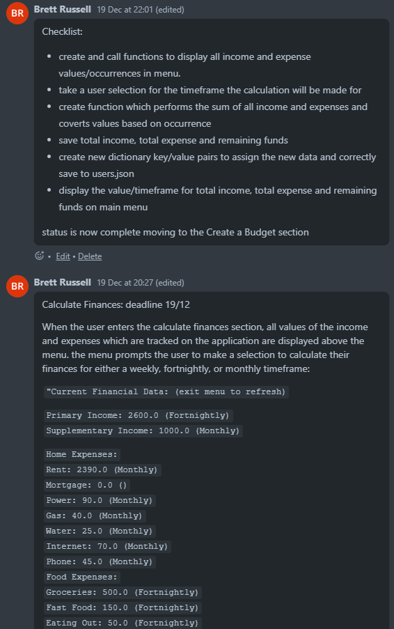

# Expense Tracker

Thankyou for taking the time to look at the terminal application submission for T1A3, my Expense Tracker.


### Styling guidellines

For this application I have made my best effort to adhere to the Python PEP 8 styling guidelines this is evident in the following:

* Indentation
* Maximum Line Length
* Imports
* Whitespace in Expressions and Statements
* Commenting
* Naming Conventions
* Code Layout
* Error Handling
* Use of Compound Statements
* Parentheses

## Features

This application contains a variety of different features including:

### display_menu

A function which makes use of the readchar package, as well as a while True loop and multiple local variables. These are usded to create a menu display where users may use arrow keys and the enter key in order to make a selection.  
This function is used commonly in the app.

### File Handling Systems

This application uses multiple functions in order to create an external file, take user input, and use that input to add, adjust and remove data from that file. This is done with functions such as:
* load_users
* save_users
* new_user_creation
* save_user_data
* delete_user
These function all make use of various conditional statements and loops designed to create an external JSON file to house user profile data, allow for new data to be stored and saved in that file and to delete stored data which is no longer necessary. As well as local variables and loops, these functions also make use of the following global variables:
* saved_users
* filename
* users_data
All of these functions and variables are imported to and regularly used in the apps main logic.

### Income Data Systems 
These functions come into two categories; those that are used to store data, and those that are used to display data. 

**add_income** and **add_expenses** are used to store data, they do this by taking a user selection which assigns a value to a predetermined variable, for instance add_income uses the income_type variable, the value of this variable determines which dictionary the input data will be stored in. They also use the variable 'occurrence' the value of this will affect dictionary data as well as the way it is calculated later. After assigning a value to 'occurrence', the next step is to implement a while True loop to assess the users input value as it must be numerical. Once this condition is met, the input data and occurrence value are both assigned into key/value pairs and stored in the users external profile dictionary.

**generate_income_info** and **generate_income_info** are used to display data in the terminal interface. They make use of the global variable current_user_data whos value is the dictionary data of the current user of the program. Because the data contained in this variable is so broad other variables are created in order to pinpoint the exact values required for function input, the wayy this is achieved is shown below:

```python
    try:
        # variable containing current users dictionary
        current_user_data = users_data[current_user.name]
    except KeyError:
        print(f"{COLOR_RED}Error: User data not found.{RESET_COLOR}")
        continue
    # variable to extract totals after calculation
    user_finance_info = generate_income_info({
        "Total Income": current_user_data['total_income'],
        "Total Expenses": current_user_data['total_expense'],
        "Remaining Funds": current_user_data['remaining_funds']
    })
    # variable to extract income values
    user_income_info = generate_income_info({
        'Primary Income': current_user_data['primary_income'],
        'Supplementary Income': current_user_data['supplementary_income']
    })
    # variables to extract expense values
    home_expense_info = generate_expense_info(
        current_user_data['expense']['home']
        )
    food_expense_info = generate_expense_info(
        current_user_data['expense']['food']
        )
    transport_expense_info = generate_expense_info(
        current_user_data['expense']['transport']
        )
    other_expense_info = generate_expense_info(
        current_user_data['expense']['other']
        )
    # variable to format the display
    user_expense_info = (
        "Home Expenses:\n     {home}\n"
        "Food Expenses:\n     {food}\n"
        "Transport Expenses:\n     {transport}\n"
        "Other Expenses:\n     {other}"
            ).format(
        home=home_expense_info,
        food=food_expense_info,
        transport=transport_expense_info,
        other=other_expense_info
    )
```
Once the information is further specified, the variables are input into the function. The functions use a for loop and conditional statement to access each value and determine how it is to be displayed, once this is achieved they return the new value of the variable. 

### calculate_finance

This function is used to show the the user their total finances based on the time parameter specified. Whilst storing income and expenses, the user must specify the occurrence of each piece of data: 'Weekly', 'Fortnightly', or 'Monthly'. In the Calculate Finances section of the program that data is converted into a single time frame for the user to easily keep track. 

The global variables which are input into this function are 'user', which contains the dictionary of the current user and 'time_frame' whos value is specified by the option the user selects in display_menu for the calculate finances section. The local variables in the function are: 'conversion', a dictionary whos keys match the value of 'time_frame' and 'total_income', 'total_expense', 'remaining_funds' whos values are determined by the function. 

Once a time frame has been expressed a for loop is executed which converts each piece of income and expense data and generates the total sum to be stored in the 'total_income' and 'total_expense' variables. After this the 'remaining_funds' variable is defined by subtracting 'total_expense' from 'total_income' and all three variables are stored into the user dictionary in the following manner:

```python
    user.total_income = {
        "amount": total_income,
        "occurrence": time_frame}
    user.total_expense = {
        "amount": total_expense,
        "occurrence": time_frame
        }
    user.remaining_funds = {
        "amount": remaining_funds,
        "occurrence": time_frame
        }
```

## Implementation plan

I used Trello in order to create an implementation plan below are the screenshots from my planning process:










## Help Guide

All the necessary requirements tp install this application will be available in my github repository you will need to download:

* main.py
* functions.py 
* user.py
* lists.py
* run.sh

you can run the program either by command line input:

```
python3 main.py
```
if you use this method you will need to ensure that you meet the minimum version requirement of Python 3.10. You will then need to create a virtual environment and install the following packages:

* readchar
* colored

to make things easier I have created a bash script to check for requirements and run the program simply download run.sh and input the command:

```
bash run.sh
```
using this command in your terminal will start the program. 

### Testing 

I have created tests for two of the program features within the test.py file, to run these tests you must have all the necessary requirements for running the program and also install pytest.

I have also created a script for running the tests to streamline this process.  
To run this script download test.sh from my github and input:

```
bash test.sh
```

both tests will provide an installation for python 3.10 on linux operating systems.

### How to use

If there are no recorded users when the program starts then it will prompt the user to enter a name, this name will be turned into a user profile and stored as a dictionary:

```
File not found. Creating a new file.
Please enter a name: Brett
```
Once a name has been input simply use the 'up' and 'down' arrow keys to navigate the main menu and each subsequent menu section and the 'enter' key to make a selection. your current position in the menu will be indicated with the '->' marker:

```
Expense Tracker
 Current User: Brett
 Total Income: $0 ()
 Total Expenses: $0 ()
 Remaining Funds: $0 ()
 
Main Menu
-> Add Income
   Add Expenses
   Calculate Finances
   New User
   Switch User
   Delete User
   Exit Application
```
When adding income or expense data, simply select a catagory and then select an occurrence, after this you can input a number value to track your data:

```
Income Data: (exit menu to refresh)
 Primary Income: $0 ()
 Supplementary Income: $0 ()
 
Select an option:
-> Add Primary Income
   Add Supplementary Income
   Main Menu
```
```
How often do you receive this income source?
-> Weekly
   Fortnightly
   Monthly
   Previous Section
```
```
How often do you receive this income source?
   Weekly
-> Fortnightly
   Monthly
   Previous Section
Enter the value of the income (press q to return): 2500
```

in the calculate finances section all your recorded data will be displayed, simply select an occurrence option and your data will be aggregated for that time frame:

```
Current Financial Data: (exit menu to refresh)

 Primary Income: $2500 (Fortnightly)
 Supplementary Income: $0 ()
 
Home Expenses:
     Rent: $2390 (Monthly)
     Mortgage: $0 ()
     Power: $70 (Monthly)
     Gas: $40 (Monthly)
     Water: $25 (Monthly)
     Internet: $70 (Monthly)
     Phone: $70 (Monthly)
Food Expenses:
     Groceries: $550 (Fortnightly)
     Fast Food: $150 (Fortnightly)
     Eating Out: $50 (Fortnightly)
Transport Expenses:
     Fuel: $0 ()
     Parking: $0 ()
     Public Transport: $0 ()
     Ride Share: $0 ()
Other Expenses:
     Streaming Services: $40 (Monthly)
     Gym Membership: $35 (Fortnightly)
     Subscriptions: $50 (Monthly)

How would you like to calculate your finances?
-> Weekly
   Fortnightly
   Monthly
   Main Menu

```
```
Expense Tracker
 Current User: Brett
 Total Income: $2500 (Fortnightly)
 Total Expenses: $2056 (Fortnightly)
 Remaining Funds: $443 (Fortnightly)
 
Main Menu
-> Add Income
   Add Expenses
   Calculate Finances
   New User
   Switch User
   Delete User
   Exit Application
```
Totals are then displayed along with the time frame calculated for on the main menu.

You may also change between different users, create new users and delete users from the main menu.

